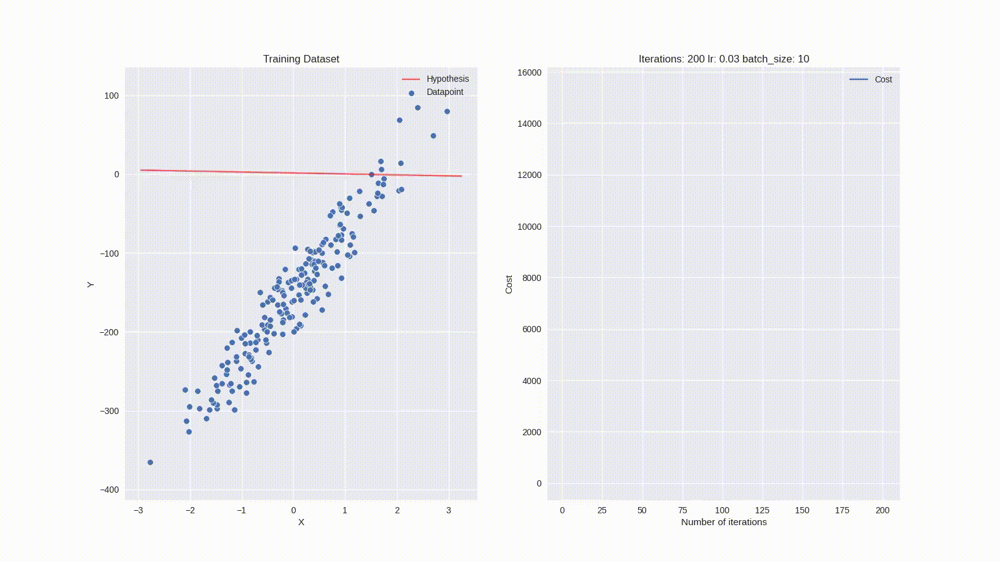
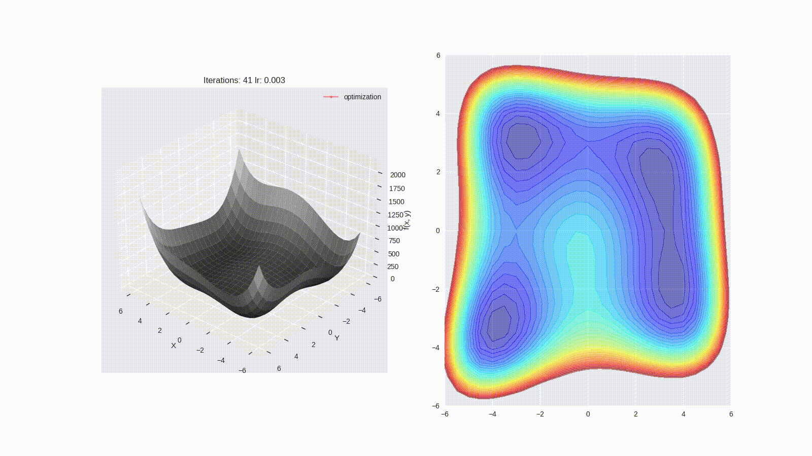

# Summer of ML 2021 - Day2
## AIML Clue IIT Delhi

### Topics Covered: 
* Introduction to ML
* Multivariable Calculus - Gradient, Hessian, Jacobian
* Gradient Descent Algorithm
* Linear Regression

### Credits: some of the material has been taken from Andrew Ng's CS229 course at Stanford University and the matrix calculus cookbook is taken from Petersen & Pedersen.

## Visualization
Credits [Gautam-J/Machine-Learning](https://github.com/Gautam-J/Machine-Learning/)

### Linear Regression

### Gradient Descent
